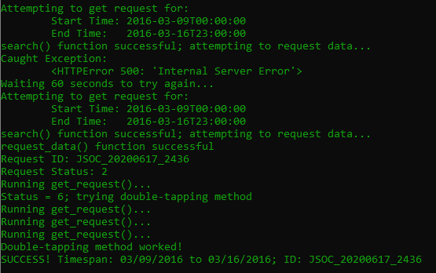

# HMI-Data-Analysis
Analysis of Magnetogram-Related Data of the Sun Obtained from the Solar Dynamics Observatory's HMI Instrument. This should not be confused with any part of the MAG4 project, which is currently a private repository due to NASA restrictions. Also, please note that many components of the programs were left unfinished, as the code written in this repository was purely for practice handling data with MAG4.

# Files

## ProcessFiles.py
Queries HMI Instrument data through the Fido API and constructs class objects from that data that represent those files.

## Magnetogram.py
Class that represents a magnetogram (solar magnetic field representation) file. Contains methods to display stats about the particular magnetogram as well as an image of what the magnetogram looks like (with and without a clip).

## AnalyzeMagnetograms.py
Uses the list of magnetogram objects constructed in ProcessFiles.py to display information to the user on any or all magnetograms.

## SetUpDownloadRequests.py
Automates the process of staging download requests from the JSOCClient so that large amounts of data can easily be downloaded later.

### Example Output

## HMI Downloaded Files
Where all of the pertinent HMI data from the query is downloaded.

## Program Saved Files
Where any scripts in the program save files that are needed by other scripts.
